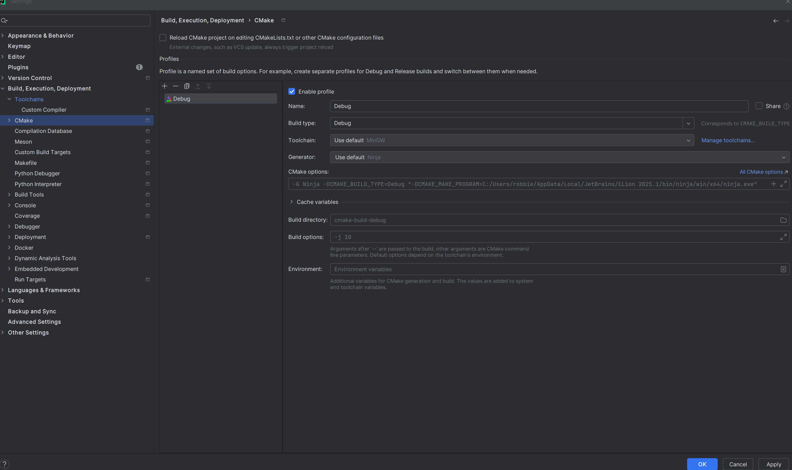
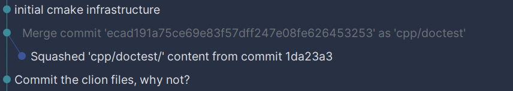

# ads-revue

Compare/contrast DSA across different languages

## TODO

* Set up Elixir workflow
* Set up Rust workflow
* Set up BQN workflow

### Completed

* set up clang-format
* set up clang-tidy
* set up ninja + VS build flows

## Building

The core work environment is CMake + Windows. Everything here should work fine on Mac + Linux, and mobile
platforms as well. CMake is required, but it is integrated with Visual Studio 2022 and CLion.

As far as CMake version, I have the min version as 3.31, but older versions should work. I don't have fancy usage.
CLion 2025 comes bundled with 3.31.

Download CMake here: https://cmake.org/download/

### CLion

CLion comes with CMake, Ninja, and MinGW built in. Additionally, CLion can quickly pick up Visual Studio installs.
CLion wraps a bunch of the functionality I use to run projects, so I recommend as someone who has enjoyed this tool.



Ninja is a great 'generator' (build tool), so I recommend sticking with it. Especially with CLion.

I prefer to use the MSVC toolchain because I tend to use some Windows-specific functionality in other projects.
`lldb` provides debugging support in that setup.

### Visual Studio 2022

If you're using Visual Studio, or even just want to switch to the debugger, you can set this up easily.

```commandline
> mkdir cmake-build-VS22-x64
> cmake.exe -G "Visual Studio 17 2022" -A "x64" -B .\cmake-build-VS22-x64
```

This will create the Visual Studio solution file, which you can open to select build configs, build, and run.

The above command line is implicitly setting the source (`-S`) folder by operating from the topline folder.
Feel free to specify explicitly.

## Repo Features

### Subtree Maintenance

Currently, I use subtrees to pull in external repos. Bringing them in is simple enough.
I can use the repo URI and a tag/branch, along with squash to have one commit.

```commandline
git subtree add --prefix=cpp/doctest https://github.com/doctest/doctest.git v2.4.12 --squash
```

Interestingly, this creates a commit off the mainline branch, and merges that into your target branch.
I did not expect this:



In the future, if I want to update the subtree, I can use this command:

```commandline
git subtree pull --prefix=cpp/doctest https://github.com/doctest/doctest.git v2.4.12 --squash
```

Basically the same command, except swap `add` for `pull`.